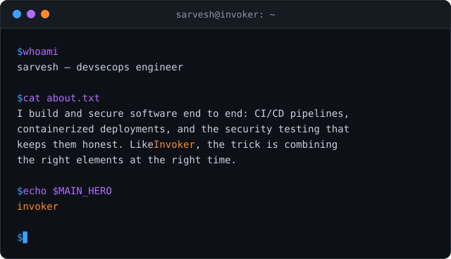
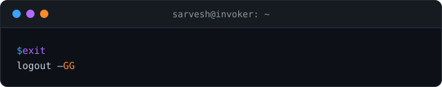

# Sarvesh Pandit

**DevSecOps Engineer · Invoker main**

*Quas. Wex. Exort. Invoke.*

### Orbs

<table>
  <tr>
    <td align="center" width="110">
       
      <b>QUAS</b> Security & Observability
    </td>
    <td>
      
      
      
      
      
    </td>
  </tr>
  <tr>
    <td align="center">
       
      <b>WEX</b> Automation & Delivery
    </td>
    <td>
      
      
      
      
      
    </td>
  </tr>
  <tr>
    <td align="center">
       
      <b>EXORT</b> Infrastructure
    </td>
    <td>
      
      
      
    </td>
  </tr>
  <tr>
    <td align="center">
       
      <b>INVOKE</b> Side quests
    </td>
    <td>
      
      
      
      
      
    </td>
  </tr>
</table>

### Spell combos

<table>
  <tr>
    <td align="center" width="110">
       
      <b>Deafening Blast</b> 🔵 🟣 🟠
    </td>
    <td align="left"><b>DevSecOps.</b> Security, automation and infrastructure in one pipeline — the signature combo.</td>
  </tr>
  <tr>
    <td align="center">
       
      <b>Alacrity</b> 🟣 🟣 🟠
    </td>
    <td align="left"><b>Fast, reliable CI/CD.</b> Automation on top of solid infrastructure, so releases ship quickly and stay boring.</td>
  </tr>
  <tr>
    <td align="center">
       
      <b>Ice Wall</b> 🔵 🔵 🟠
    </td>
    <td align="left"><b>Hardened deployments.</b> Secrets in Vault, locked-down containers and clusters, monitored end to end.</td>
  </tr>
  <tr>
    <td align="center">
       
      <b>Ghost Walk</b> 🔵 🔵 🟣
    </td>
    <td align="left"><b>Recon &amp; security testing.</b> Scripted scans with Nmap and Burp Suite that find the gaps quietly, before anyone else does.</td>
  </tr>
  <tr>
    <td align="center">
       
      <b>Sun Strike</b> 🟠 🟠 🟠
    </td>
    <td align="left"><b>Global deploys.</b> Containerized releases on Kubernetes that land anywhere on the map.</td>
  </tr>
</table>

### Why I pick Invoker

### Join my lobby

